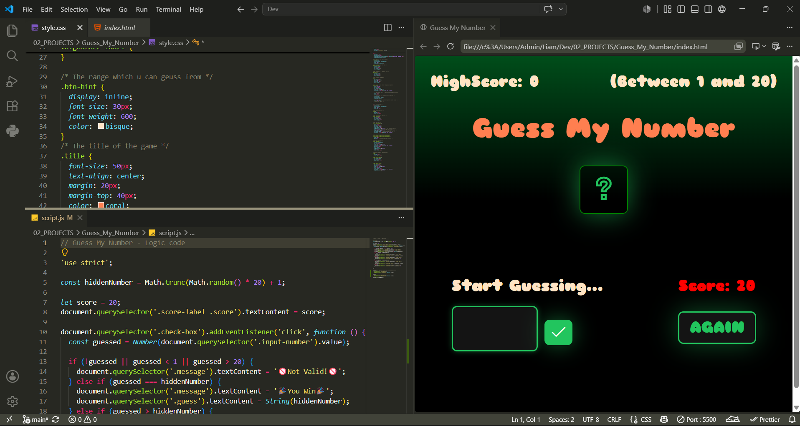
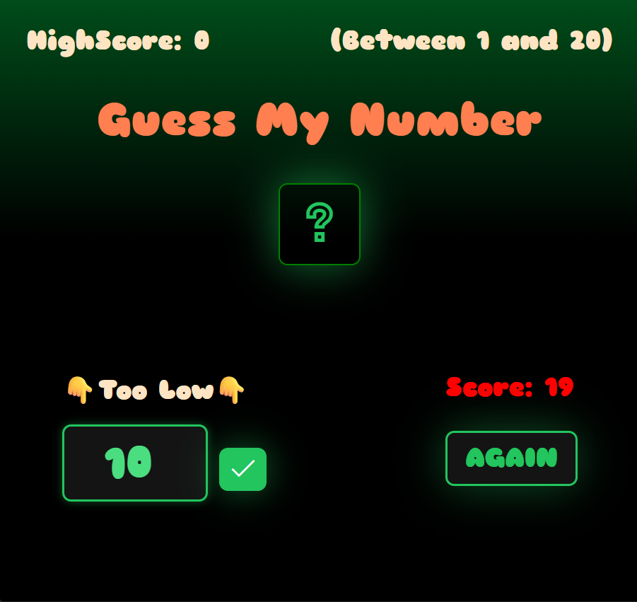
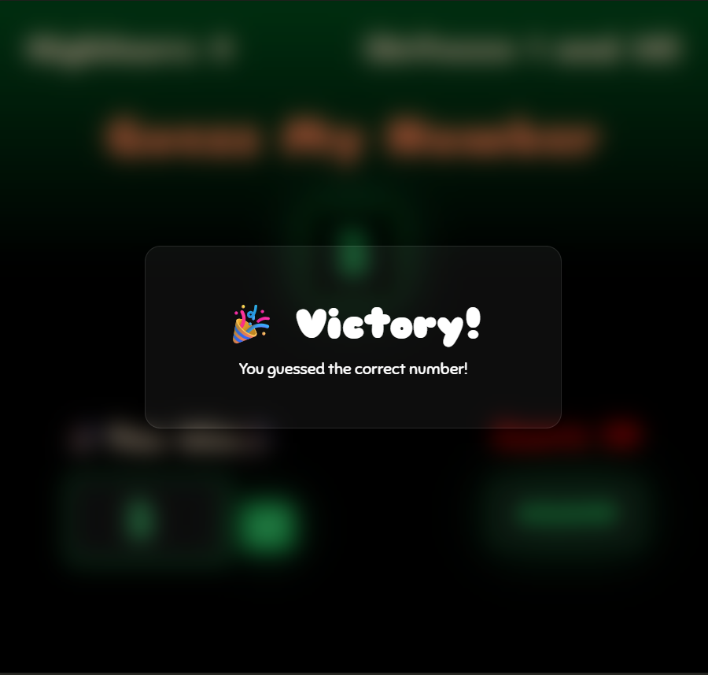

# 🎯 Guess My Number

A fun and interactive number guessing game built with HTML, CSS, and JavaScript. The goal is simple: guess the hidden number between 1 and 20 before running out of chances.

## ✨ What this project does

This project helps practice:

- JavaScript logic and conditionals
- DOM manipulation
- event handling with buttons and inputs
- score tracking and game state updates
- simple game design with a clean user interface

## 🎮 How the game works

1. The game picks a random number between 1 and 20.
2. The player enters a guess.
3. The game tells the player if the guess is too high or too low.
4. The score decreases with each wrong attempt.
5. The player can restart the game at any time.
6. A highscore is tracked to encourage replaying.

## 🧠 Core features

- 🎲 Random number generation
- ✅ Correct guess detection
- 📉 Score countdown
- 🏆 Highscore tracking
- 🔄 Reset/restart button
- 💡 Friendly feedback messages

## ▶️ How to run

Open the project in your browser:

1. Open the folder in VS Code.
2. Open [Guess_My_Number/index.html](Guess_My_Number/index.html).
3. Run it with Live Server or simply open the file in a browser.

## �️ Screenshots

## �🛠️ Technologies used

- HTML
- CSS
- JavaScript

## 📁 Project structure

- index.html — the game layout
- style.css — styling for the UI
- script.js — game logic and interactions

## 🚀 Future ideas

You can improve this project by adding:

- difficulty levels
- sound effects
- animations
- a timer mode
- a mobile-friendly layout

## 👨‍💻 Author

Built as a beginner-friendly JavaScript practice project.
